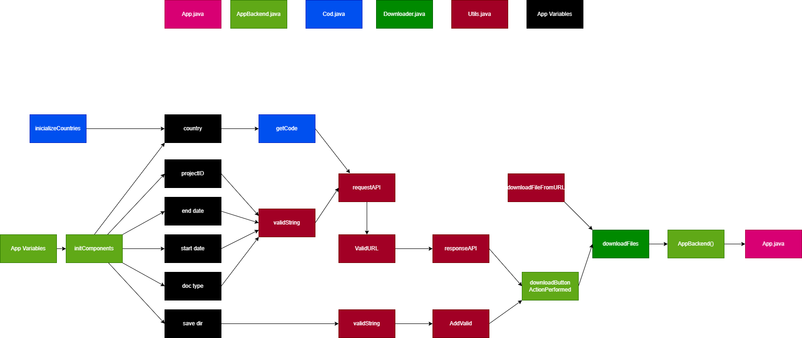

# APP

## `App.java`

- `App`

> Initialize the application and display it to the user.

## `AppBackend.java`

- `AppBackend`

> This method is likely used to initialize and set up the components of a graphical user interface (GUI).

- `downloadButtonActionPerformed()`

> downloads files from the World Bank API based on user input.

```java
@param evt The `evt` parameter is an `ActionEvent` object that represents the action event that occurred (click download button).
```

## `Cod.java`

- `initializeCountries()`

> Initializes a map with country names as keys and their corresponding country codes as values.

- `getCode()`

```java
@param country The parameter "country" is a String that represents the name of a country.
@return The code variable is being returned.
@example
getCode("Peru") -> "PE"
getCode("Belfium") -> "BE"
```

## `Downloader.java`

- `downloadFiles()`

> Downloads PDF and TXT files from URLs provided in a JSON object and saves them in a specified directory.

```java
@param docs The parameter "docs" is a JsonObject containing the response from the API.
@param mainPath The mainPath parameter is the path where the downloaded files will be saved.
@return void
```

## `Utils.java`

- `responseAPI()`

> Sends a GET request to a specified URL (World Bank), retrieves the response body, parses it as JSON, and returns the `documents` object from the JSON response.

```java
@param url The `url` parameter is a string that represents the URL of the API endpoint that you want to make a request to.
@return The method is returning a JsonObject.
```

- `downloadFileFromURL()`

> Downloads a file from a given URL and saves it to a specified destination path.

```java
@param urlString The URL of the file you want to download.
@param destination The "destination" parameter is the name of the file want to save the downloaded content as. It should include the file extension as well (PDF and TXT).
@param wherePath The `wherePath` parameter is the directory path where you want to save the downloaded file.
```

- `validURL()`:

> Create a valid URL for downloading the PDF and TXT files. The function takes a target string and a JsonObject, and returns a modified URL string by replacing "http:" with "https:" and "//documents." with "//documents1.".

```java
@param target The target parameter is a String that represents the key of the value we want to retrieve from the JsonObject doc.
@param doc The "doc" parameter is a JsonObject that contains some data. It is used to retrieve a value associated with the "target" key.
@return The method is returning a modified URL string.
```

- `addValid()`

> The function adds a double forward slash to the end of a path if it doesn't already have one.

```java
@param path The parameter "path" is a string representing a URL.
@return The method is returning the modified PATH string.
```

- `validString()`

> The function "validString" checks if a given string is empty and returns null if it is, otherwise it returns the string itself.

```java
@param str The parameter "str" is a string that is being passed into the "validString" method.
@return The method is returning the input string if it is not empty. If the input string is empty, it is returning null.
```

- `requestAPI()`

> The function `requestAPI` takes in various parameters related to a World Bank API request and constructs the corresponding URL to retrieve the desired data.

```java
@param country1 The country code or name for which you want to request data.
@param start_date1 The start date of the API request in the format "yyyy-MM-dd".
@param end_date1 The end date for the API request. It is a string representing a date in the format "YYYY-MM-DD".
@param lndinstr The "lndinstr" parameter is used to specify the type of lending instrument for the API request. It is a string that represents the lending instrument, such as "Investment Project Financing".
@param project_id1 The project ID is a unique identifier for a specific project. It is used to search for a specific project in the API.
@param rows The number of rows to be returned in the API response.
@return The method returns a string that represents the URL for making an API request to the World Bank database. The URL includes various parameters such as country code, start date, end date, project ID, and number of rows to retrieve.

```


